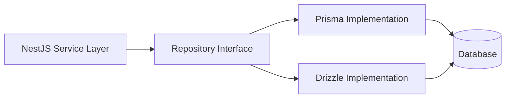
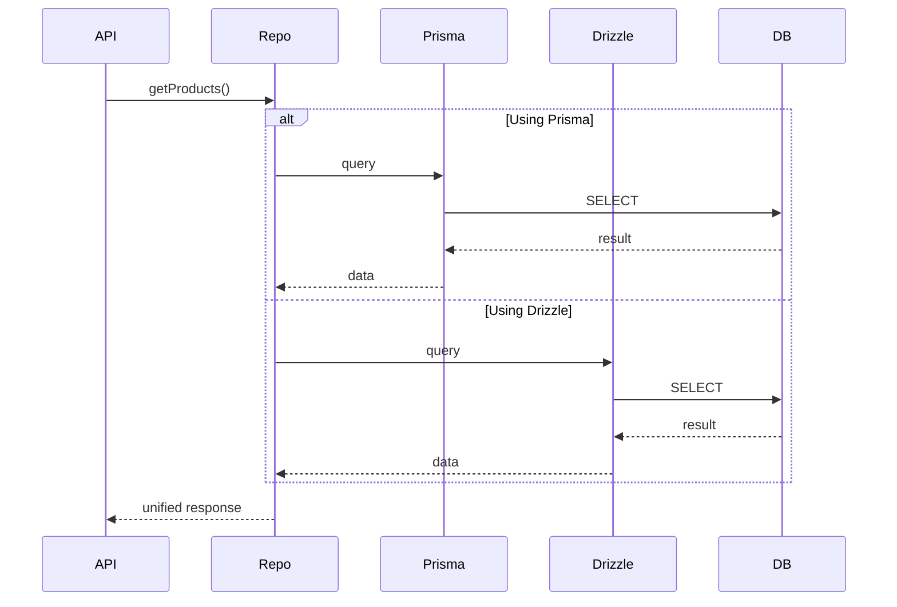
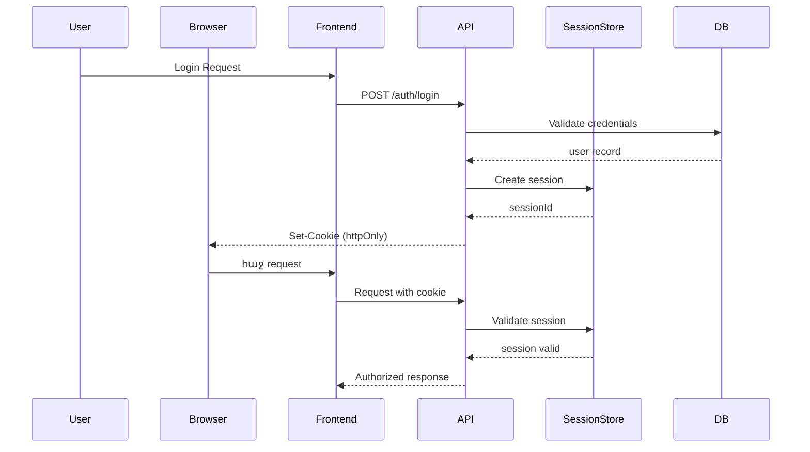

# 🔄 Database Migration Plan (Prisma → Drizzle / Supabase)

## 🎯 Goal

Enable a **non-breaking migration** from Prisma ORM to a more flexible stack such as **Drizzle ORM** or **Supabase**, without rewriting your API layer.

---

## 🧩 Migration Strategy

### 1. Introduce Repository Abstraction Layer

Instead of calling Prisma directly:

```ts
// ❌ avoid
this.prisma.product.findMany()
```

Use a repository pattern:

```ts
// ✅ abstraction
this.productRepository.findAll()
```

---

---

### 2. 📐 Architecture Flow



---

### 3. 🔀 Dual-ORM Transition Phase
During migration:



---

### 4. ✈️ Migration Steps

1. Add repository interfaces  
2. Wrap all Prisma queries  
3. Introduce Drizzle implementation  
4. Toggle via environment flag:

```bash
DB_PROVIDER=prisma
# or
DB_PROVIDER=drizzle
```

5. Gradually switch endpoints
6. Remove Prisma after validation

---

## ⚠️ Key Considerations
- Keep DTOs stable (no API breaking changes)
- Avoid Prisma-specific types leaking into services
- Ensure migrations are replicated in both systems
- Use integration tests to validate parity

---

## 🔐 Authentication Architecture (Cookie-Based Sessions)

### 🎯 Goal
Implement secure, scalable authentication using **HTTP-only cookies + session storage**

---

### 🧩 Auth Flow



---

## 🧩 Architecture Overview

```mermaid
flowchart LR
    A[Browser]
    B[Next.js Frontend]
    C[NestJS API]
    D[Session Store (Redis / DB)]
    E[(Database)]

    A -->|HTTP Cookie| B
    B --> C
    C --> D
    C --> E
```

---

## 🔑 Key Decisions
Why Cookies over JWT?
- ✅ Automatic browser handling
- ✅ Safer against XSS (httpOnly)
- ✅ Easier session invalidation
- ❌ Requires session store (Redis recommended)

---

```ts
{
  httpOnly: true,
  secure: true,
  sameSite: 'lax',
  maxAge: 7 * 24 * 60 * 60 * 1000
}
```

---

## 🧩 Session Store Options
- Redis (recommended for scaling)
- Database (simpler, slower)
- In-memory (dev only)

🏷️ Semantic Versioning Strategy (Per Phase)