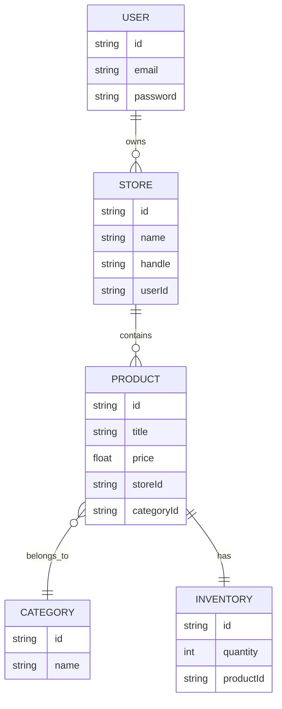
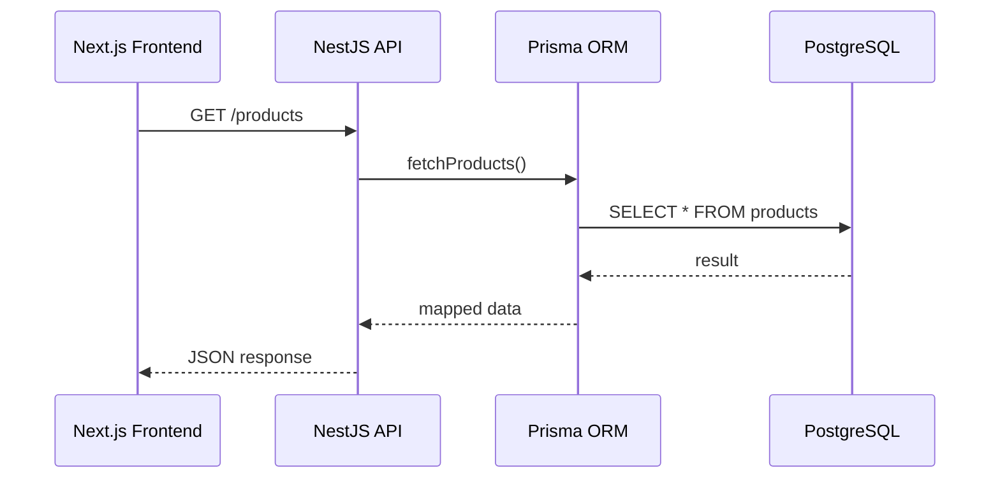
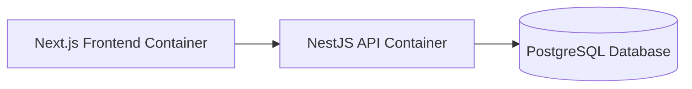
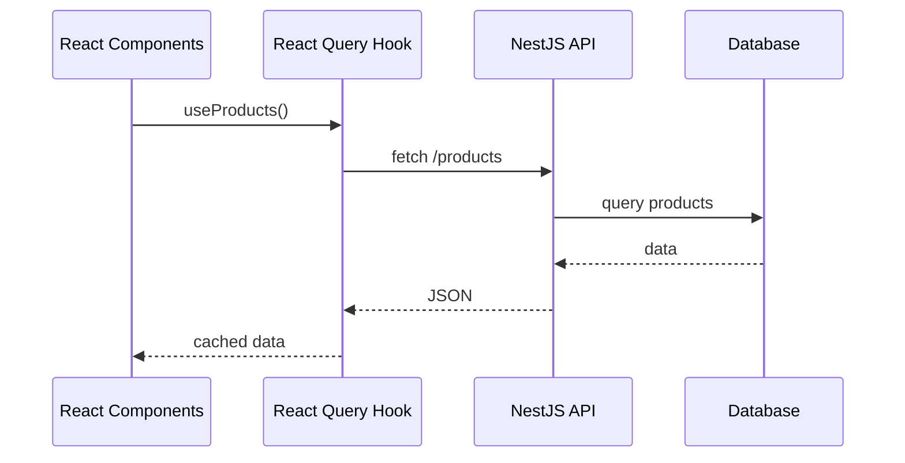
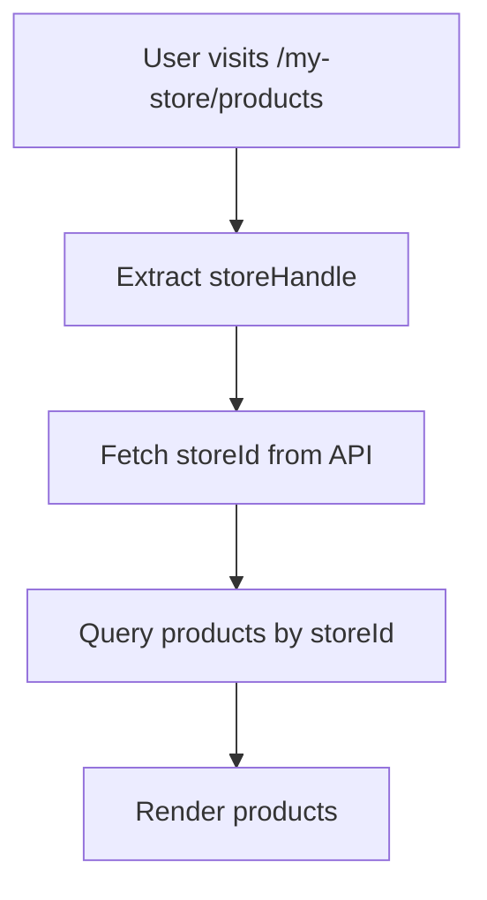
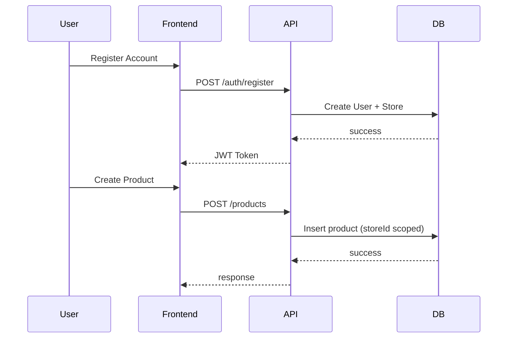
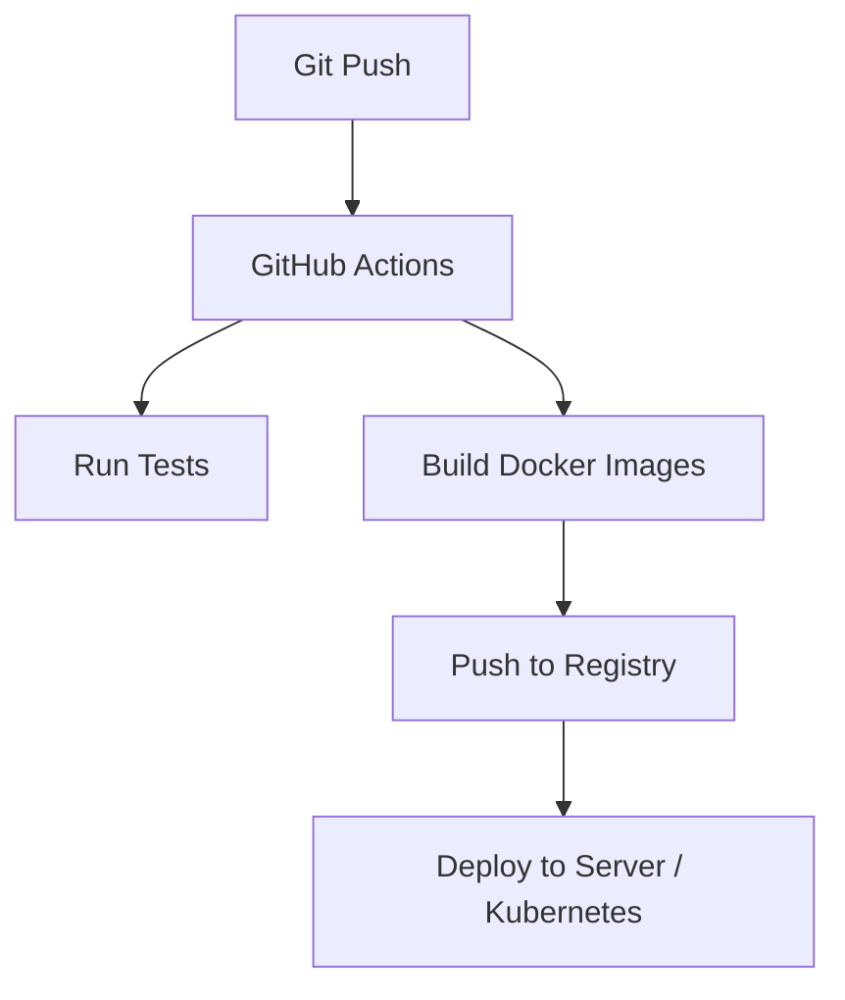
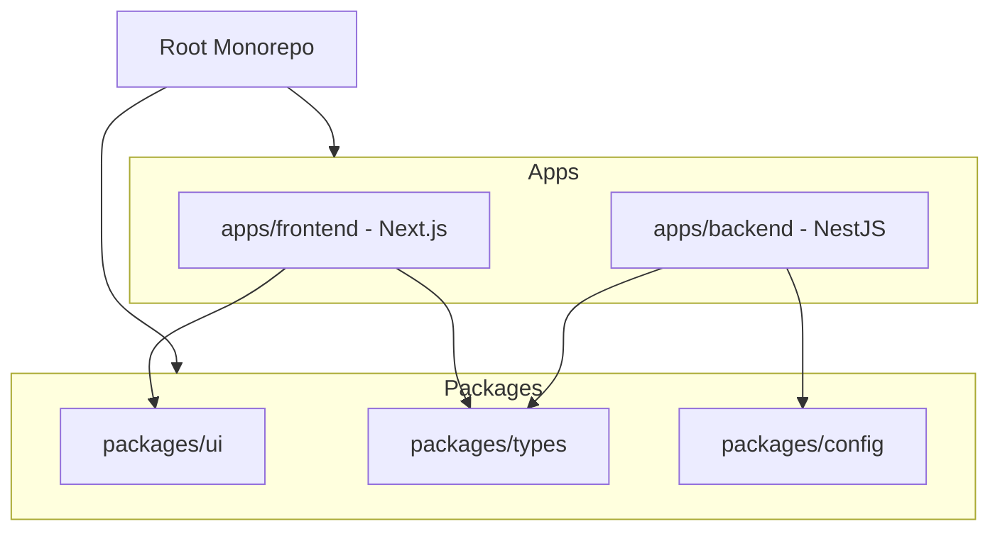
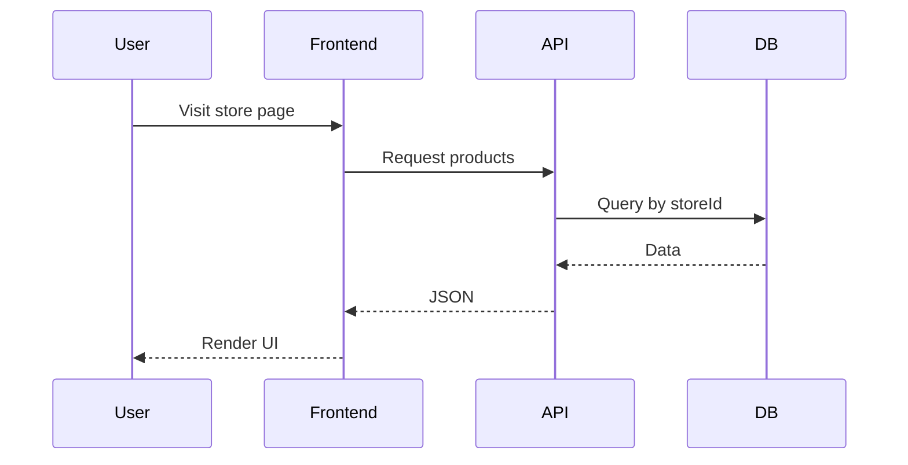

import Tabs from '@theme/Tabs';
import TabItem from '@theme/TabItem';

# 🧱 E-Commerce Inventory Management System — Architecture & Development Plan

## 📌 Overview

This project transitions a frontend built on a Shopify template into a fully custom, multi-tenant **Product Inventory System**.

### 🎯 Goals

- Own the **data layer**
- Control **business logic**
- Enable **multi-store support**
- Build a **scalable DevOps-ready system**

---

# 🗺️ Development Phases

---

## Phase 1 — 👷‍♂️ Infrastructure & Backend Core

### 🎯 Goal
Establish backend as the **source of truth**

---

### 🧩 Database Schema (Prisma)



---

### 🔄 Sequence Flow



---

### 🧱 Architecture Flow



---

## Phase 2 — ⛓️‍💥 Frontend Decoupling

### 🎯 Goal
Replace Shopify dependencies with internal API

### 🔄 Data Fetching Flow



---

### 🔧 Key Changes

- Replace use-shopify → **custom hooks**
- Use React Query
- Replace environment variable:

```bash
NEXT_PUBLIC_API_URL=http://localhost:3000
```

## Phase 3 — 🤝 Multi-Tenancy & Store System

### 🎯 Goal

Support **multiple** independent stores

---

### 🧩 Store Routing



---

### 🔄 Auth + Store Flow



---

## Phase 4 — 👨‍💻 DevOps & Scalability



### 🧩 Migration Strategy in the future

- Abstract service layer
- Replace ORM without breaking API:
  - Prisma → Drizzle / Supabase

### 🧱 Monorepo Architecture (Turborepo)



## 📁 Suggested Structure

```bash
apps/
  frontend/   # Next.js app
  backend/    # NestJS API

packages/
  ui/         # shared components
  types/      # shared types/interfaces
  config/     # eslint, tsconfig, etc.
```

## 🔁 System-Wide Data Flow



## 🆚 Shopify vs Custom System

| Feature         | Shopify Template     | Custom System   |
|-----------------|----------------------|-----------------|
| Database        | Shopify-managed      | SQL (Prisma)    |
| API             | Shopify GraphQL      | NestJS API      |
| Control         | Limited              | Full            |
| Auth            | External             | Internal        |
| Multi-tenancy   | Built-in             | Custom          |

## 🧠 Design Principles
- Decoupled Architecture
- Interface Stability
- Scalability-first mindset
- ORM abstraction

🚀 Future Enhancements
- Role-based access control
- Order management system
- Analytics dashboard
- Redis caching
- Event-driven architecture (webhooks)