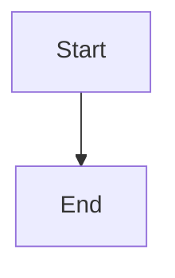
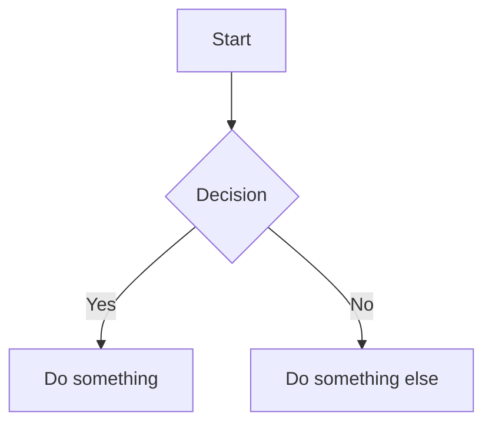
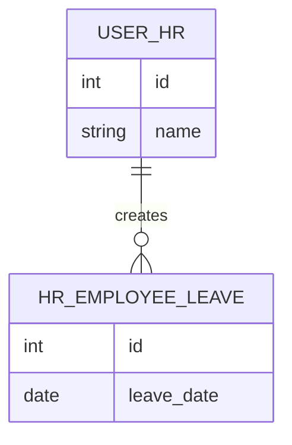
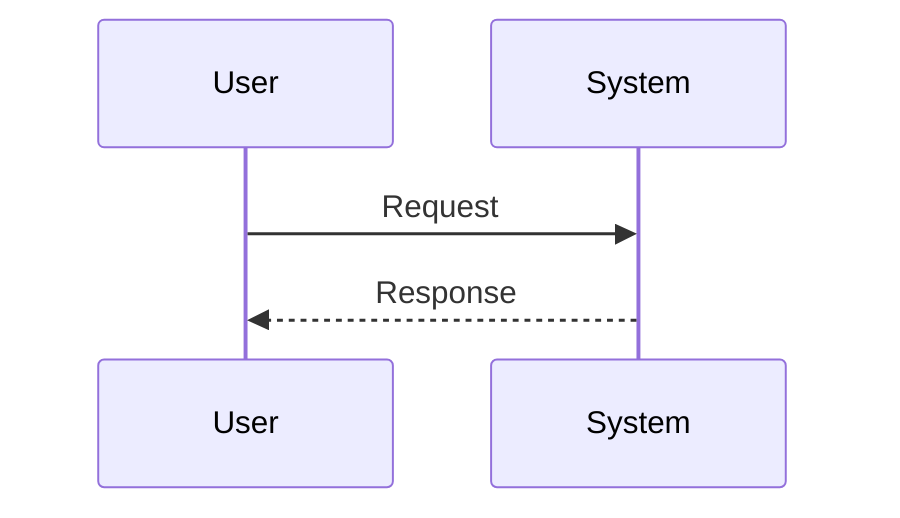
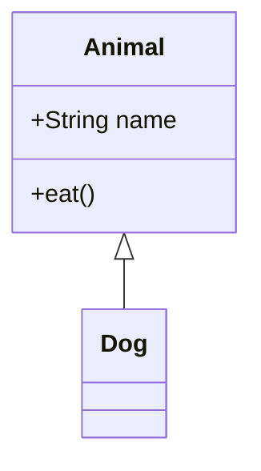
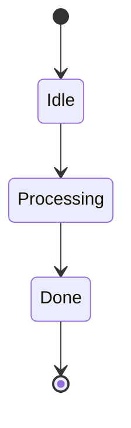
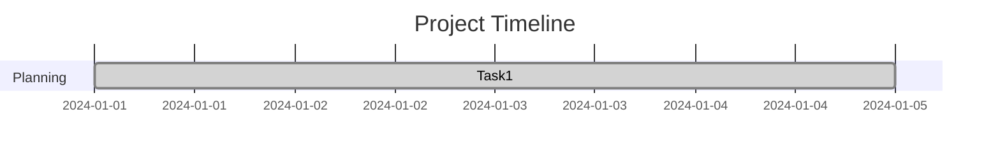

## 🧭 Overview

Mermaid is a JavaScript-based diagramming and charting tool that lets you create diagrams using simple text syntax. It’s widely used in documentation, Markdown files, and developer tools.

## 🚀 Basic Syntax

A Mermaid diagram starts with a code block declaring its type and layout direction.

- `graph TD` → Top-down layout  
- `graph LR` → Left-to-right layout

---

## 📊 Types of Diagrams

### 1. Flowchart

### 2. ER Diagram (Entity Relationship)

ER diagrams define entities and their relationships.

#### Symbol Meaning Breakdown

| Symbol        | Meaning            |
|---------------|--------------------|
| `\|`          | Exactly one        |
| `o`           | Zero (optional)    |
| `{` or `}`    | Many               |

#### Quick Reference

| Syntax           | Relationship   |
|------------------|---------------|
| `A \|\|--\|\| B` | One-to-one    |
| `A \|\|--o{ B`   | One-to-many   |
| `A }o--\|\| B`   | Many-to-one   |
| `A }o--o{ B`     | Many-to-many  |

#### Example ER Diagram:

### 3. Sequence Diagram

### 4. Class Diagram

### 5. State Diagram

### 6. Gantt Chart

---

## ✍️ Styling & Customization

Labels
To add text on lines or arrows, use the pipe syntax:A -->|Yes| B

Shapes (Flowcharts)
Change node appearances by closing your declarations with different bracket types:

- [Text] -> Rectangle

- (Text) -> Rounded Rectangle

- &#123;Text&#125; -> Diamond

- ((Text)) -> Circle

---

## 🧠 Best Practices

- Consistent Naming: Use UPPER_CASE for ER diagrams (e.g., USER_ACCOUNT).

- No Spaces: Avoid spaces in entity names. Use underscores instead (e.g., user_account).

- KISS: Keep diagrams simple and readable. Break massive diagrams into smaller, connected ones.

- Clarity: Add labels on your connecting lines to clarify relationships.

---

## ⚠️ Common Mistakes

- ❌ Using spaces in ER entity names

    - ✔️ Fix: Use USER_ACCOUNT instead of User Account.

- ❌ Forgetting diagram type

    - ✔️ Fix: Always define the diagram type at the top (like erDiagram or flowchart TD).

- ❌ Incorrect relationships

    - ✔️ Fix: Match symbols to real-world data logic.

---

## 🧩 Tips for Docs Platforms (MDX)

- Wrap your Mermaid code in standard triple backticks with the language set to mermaid.

- Ensure your documentation platform supports Mermaid natively or via plugin. For example, Docusaurus requires the @docusaurus/theme-mermaid theme added to your config file.

- Keep diagrams modular for better reusability across pages!

---